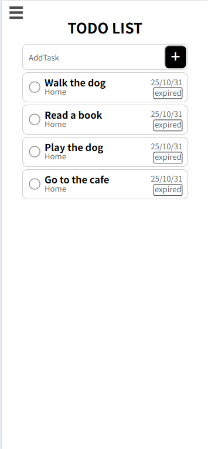
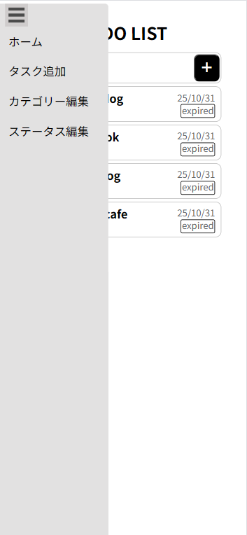
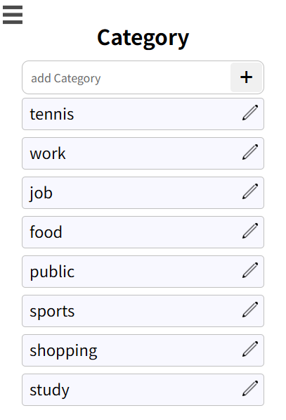
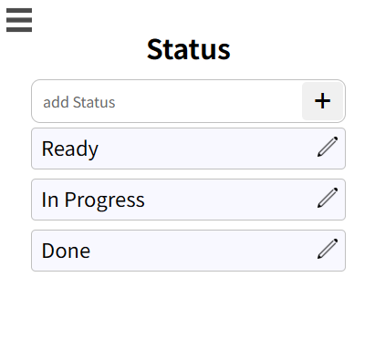

# ToDoApp

ToDoApp は、日々のタスク管理を効率化するための PC アプリです。\
プログラミング技術を高めていきたいという思いで、開発しました。\
タスク登録・編集・カテゴリー/ステータス管理など、シンプルだけど使いやすい機能にしています。

---

## 機能

-   タスクの一覧表示・追加・編集
-   カテゴリーの管理（追加・編集）
-   ステータスの管理

### 今後実装予定

-   ステータス変更などの UI 更新
-   タスク優先度管理
-   フィルター/ソート機能

---

## アプリ画面






---

## 使用技術

### frontend

-   HTML / CSS / JavaScript / TypeScript

### backend

-   Node.js / Express

### Database

-   SQLite3

### Tools / Others

-   Git / GitHub
-   Electron
-   VSCode

---

## アーキテクチャ

-   **フロントエンド**: TypeScript + Vite
-   **バックエンド**: Express (Electron メインプロセスに統合)
-   **データベース**: SQLite3 (ローカルファイル)
-   **デスクトップ化**: Electron

---

## インストール方法

開発環境が不要な場合は、以下から実行ファイルをダウンロードできます：
[Releases](https://github.com/TaroHubee/ToDoApp/releases)

Windows 向けの `ToDoApp Setup x.x.x.exe` をダウンロードして実行してください。

## セットアップ方法

### 必要な環境

-   Node.js 18.x 以上
-   npm 9.x 以上

### セットアップ手順

1. クローン
    ```bash
    git clone https://github.com/TaroHubee/ToDoApp.git
    cd ToDoApp/frontend-vite
    ```
2. 依存パッケージのインストール
    ```bash
    npm ci
    ```
3. 開発環境アプリ起動
    ```bash
    npm run electron:dev
    ```
4. 実行ファイルをビルド
    ```bash
    npm run electron:build
    ```

---

## 開発用コマンド

-   `npm run dev`: Vite の開発サーバー起動（フロントエンドのみ）
-   `npm run electron:dev`: Electron 開発モード
-   `npm run build`: フロントエンドのビルド
-   `npm run build:backend`: バックエンドのビルド
-   `npm run electron:build`: 実行ファイルの生成

---

## ディレクトリ構成

<details>
<summary>ディレクトリ構成</summary>

```
ToDoApp/
├── .git/
├── .github/
│   └── workflows/
│       └── release.yaml
├── .gitignore
├── .prettierrc.json
├── README.md
├── backend/                          # オリジナルのバックエンド(Webアプリ用)
│   ├── .env
│   ├── .env.local
│   ├── .gitignore
│   ├── package.json
│   ├── package-lock.json
│   ├── tsconfig.json
│   ├── DBmodel/
│   ├── dist/
│   ├── node_modules/
│   └── src/
│       ├── server.ts
│       ├── controllers/
│       │   ├── categoryController.ts
│       │   ├── statusController.ts
│       │   └── taskController.ts
│       ├── db/
│       │   └── database.ts
│       ├── repositories/
│       │   ├── categoryRepository.ts
│       │   ├── statusRepository.ts
│       │   └── taskRepository.ts
│       ├── routes/
│       │   ├── categoryRoutes.ts
│       │   ├── statusRoutes.ts
│       │   └── taskRoutes.ts
│       └── services/
│           ├── categoryService.ts
│           ├── statusService.ts
│           └── taskService.ts
├── database/                         # オリジナルのデータベース(Webアプリ用)
│   ├── .gitignore
│   └── database.db
├── frontend-vite/                    # Electronアプリケーション(メイン)
│   ├── .env.local
│   ├── .env.production
│   ├── .gitignore
│   ├── electron-builder.yml
│   ├── index.html
│   ├── package.json
│   ├── package-lock.json
│   ├── tsconfig.json
│   ├── vite.config.ts
│   ├── backend-src/                  # 統合されたバックエンド
│   │   ├── server.ts
│   │   ├── tsconfig.json
│   │   ├── controllers/
│   │   │   ├── categoryController.ts
│   │   │   ├── statusController.ts
│   │   │   └── taskController.ts
│   │   ├── db/
│   │   │   └── database.ts
│   │   ├── repositories/
│   │   │   ├── categoryRepository.ts
│   │   │   ├── statusRepository.ts
│   │   │   └── taskRepository.ts
│   │   ├── routes/
│   │   │   ├── categoryRoutes.ts
│   │   │   ├── statusRoutes.ts
│   │   │   └── taskRoutes.ts
│   │   └── services/
│   │       ├── categoryService.ts
│   │       ├── statusService.ts
│   │       └── taskService.ts
│   ├── build/                        # ビルド用アイコン
│   │   ├── icon.icns
│   │   ├── icon.ico
│   │   └── icon.png
│   ├── database/                     # 開発環境用データベース
│   ├── dist/                         # フロントエンドビルド出力
│   ├── dist-backend/                 # バックエンドビルド出力
│   ├── dist-electron/                # Electronビルド出力
│   ├── doc/
│   │   └── architecture.md
│   ├── electron/                     # Electronメイン・プリロードプロセス
│   │   ├── main.ts
│   │   ├── preload.ts
│   │   └── tsconfig.json
│   ├── node_modules/
│   ├── pages/
│   │   └── edit.html
│   ├── public/
│   │   ├── vite.svg
│   │   └── fig/
│   │       ├── calender.png
│   │       ├── checkedCircle.png
│   │       ├── edit.png
│   │       ├── garbedge.jpg
│   │       ├── menu.png
│   │       └── unCheckedCircle.png
│   ├── release/                      # electron-builderの出力
│   ├── src/                          # フロントエンドソース
│   │   ├── APIURL.ts
│   │   ├── config.ts
│   │   ├── databaseManeger.ts
│   │   ├── editor.ts
│   │   ├── global.d.ts
│   │   ├── main.ts
│   │   ├── menu.ts
│   │   ├── nameBox.ts
│   │   ├── overlay.ts
│   │   ├── pagemaker.ts
│   │   ├── style.css
│   │   ├── taskBox.ts
│   │   ├── typescript.svg
│   │   └── styles/
│   │       ├── addTask.css
│   │       ├── button.css
│   │       ├── common.css
│   │       ├── container.css
│   │       ├── edit.css
│   │       ├── header.css
│   │       ├── index.css
│   │       ├── reset.css
│   │       ├── slider.css
│   │       └── style.css
│   └── ...
└── ScreenShot/
    ├── カテゴリー管理画面.png
    ├── ステータス管理画面.png
    ├── タスク一覧画面-メニュー.png
    ├── タスク一覧画面.png
    └── タスク追加画面.png
```

</details>

### データについて

-   開発環境: `frontend-vite/database/database.db`
-   本番環境（ビルド後）: `%APPDATA%\ToDoApp\database.db`

### プロジェクト構成について

このリポジトリには 2 つのバージョンがあります：

-   **frontend-vite/**: Electron デスクトップアプリ（現在のメインバージョン）
-   **backend/** + **database/**: Web アプリ版の参考実装（非推奨）

開発・使用する場合は `frontend-vite/` を使用してください。

---

## Author

Taro HITOMI

---

## License

This project is licensed under the MIT License。
