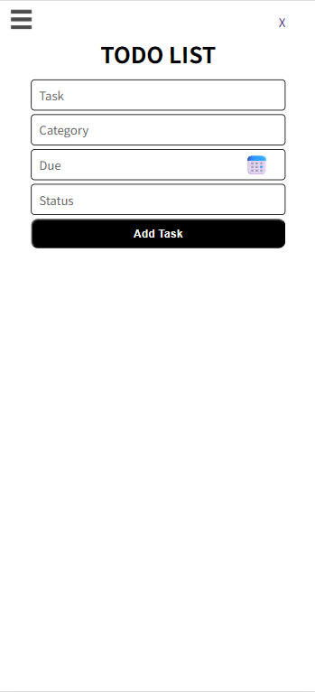

# ToDoApp
ToDoAppは、日々のタスク管理を効率化するためのWebアプリです。\
プログラミング技術を高めていきたいという思いで、開発を進めています。\
タスク登録・編集・カテゴリー/ステータス管理など、シンプルだけど使いやすい機能にしています。
---
## 機能
### 実装済み
- タスク一覧画面
- タスク追加画面
- カテゴリー管理画面
- タスク追加機能
- カテゴリー追加・編集機能
### 今後実装予定
- タスク/カテゴリーのDB連携
- ログイン機能
- ステータス変更などのUI更新
- タスク優先度管理
- フィルター/ソート機能

---
## アプリ画面





---
## 使用技術
### frontend
- HTML / CSS / JavaScript / TypeScript
### backend
- Node.js / Express
### Database
- SQLite3
### Tools / Others
- Git / GitHub
- VSCode

---
## セットアップ方法
1. クローン
   ```bash
   git clone https://github.com/あなたの名前/ToDoApp.git
   cd ToDoApp
   ```
2. 依存パッケージのインストール
   ```bash
   npm ci
   ```
3. サーバー起動
   ``` bash
   cd backend
   npx ts-node src/server.ts
   ```
4. tsファイルコンパイル
   ``` bash
   cd frontend
   tsc
   ```
---
## ディレクトリ構成
```
ToDoApp/
├── backend/         # API・DB まわり
├── frontend/        # HTML/CSS/TS
└── README.md
```
## 開発ログ
- 進捗はcommit / issue / pull requestにて更新中

---
## Author
Taro HITOMI

---
## License
This project is licensed under the MIT License.