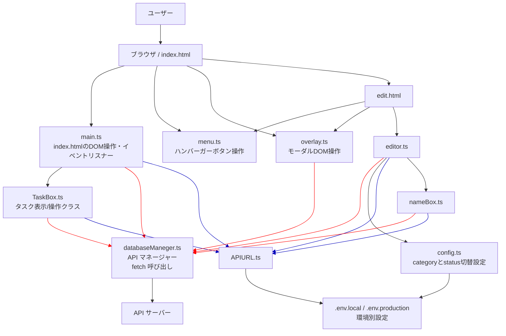

```mermaid
flowchart TD
    A[ユーザー] --> B[ブラウザ / index.html]
    B --> C[main.ts<br>index.htmlのDOM操作・イベントリスナー]
    B --> K[menu.ts<br> ハンバーガーボタン操作]
    B --> L[overlay.ts<br>モーダルDOM操作]
    B --> M[edit.html]
    C --> D[TaskBox.ts<br>タスク表示/操作クラス]
    C --> E[databaseManeger.ts<br>API マネージャー<br>fetch 呼び出し]
    C --> H[APIURL.ts]
    D --> E
    D --> H
    E --> F[API サーバー]
    G --> J[.env.local / .env.production<br>環境別設定]
    L --> E
    M --> K
    M --> L
    M --> N[editor.ts]
    N --> E
    N --> G[config.ts<br>categoryとstatus切替設定]
    N --> H
    N --> O[nameBox.ts]
    O --> E
    O --> H
    H --> J
    

    linkStyle 6 stroke:#ff0000
    linkStyle 8 stroke:#ff0000
    linkStyle 12 stroke:#ff0000
    linkStyle 16 stroke:#ff0000
    linkStyle 20 stroke:#ff0000

    linkStyle 7 stroke:#0000bb
    linkStyle 9 stroke:#0000bb
    linkStyle 18 stroke:#0000bb
    linkStyle 21 stroke:#0000bb
    
```