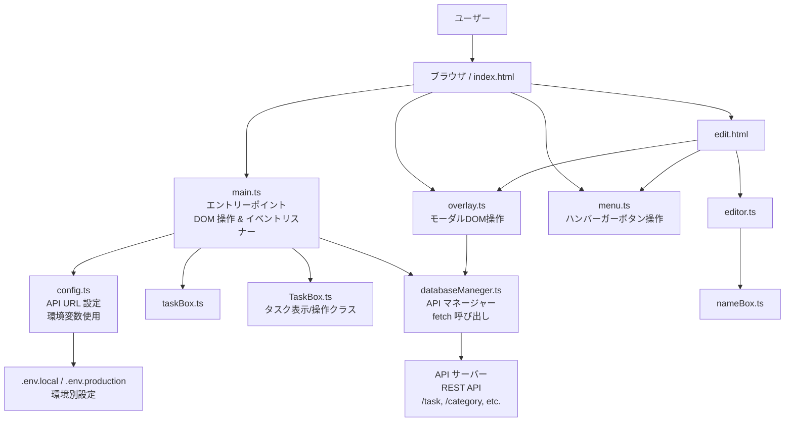

```mermaid
flowchart TD
    A[ユーザー] --> B[ブラウザ / index.html]
    B --> C[main.ts<br>エントリーポイント<br>DOM 操作 & イベントリスナー]
    B --> L[overlay.ts<br>モーダルDOM操作]
    B --> K[menu.ts<br> ハンバーガーボタン操作]
    C --> G[config.ts<br>API URL 設定<br>環境変数使用]
    C --> H[taskBox.ts]
    C --> D[TaskBox.ts<br>タスク表示/操作クラス]
    C --> E[databaseManeger.ts<br>API マネージャー<br>fetch 呼び出し]
    L --> E
    E --> F[API サーバー<br>REST API<br>/task, /category, etc.]
    G --> J[.env.local / .env.production<br>環境別設定]

    B --> M[edit.html]
    M --> N[editor.ts]
    M --> K
    M --> L
    N --> O[nameBox.ts]
    
```