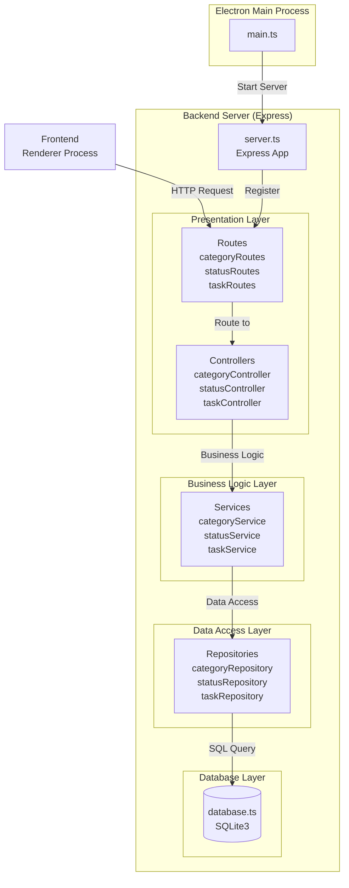
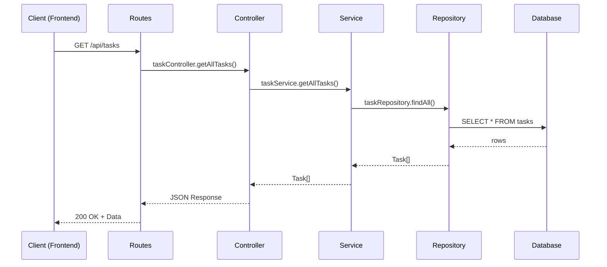
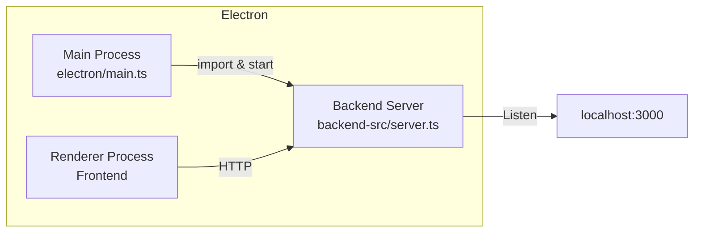

# バックエンドアーキテクチャ

## 概要

バックエンドは**レイヤードアーキテクチャ**（層状アーキテクチャ）を採用しています。
各層が明確な責任を持ち、依存関係が一方向（上位層から下位層へ）になるよう設計されています。

## アーキテクチャ図



## データフロー



## 各層の責務

### 1. Routes（ルーティング層）
- HTTPエンドポイントの定義
- リクエストをControllerにルーティング
- **ファイル**: `categoryRoutes.ts`, `statusRoutes.ts`, `taskRoutes.ts`

**例**:
```typescript
router.get('/api/tasks', taskController.getAllTasks);
router.post('/api/tasks', taskController.createTask);
```

### 2. Controllers（コントローラー層）
- HTTPリクエスト/レスポンスの処理
- バリデーション
- Serviceの呼び出しとレスポンス整形
- **ファイル**: `categoryController.ts`, `statusController.ts`, `taskController.ts`

**責務**:
- リクエストパラメータの取得
- Serviceへの処理委譲
- HTTPステータスコードとレスポンスの返却

### 3. Services（ビジネスロジック層）
- ビジネスルールの実装
- トランザクション管理
- 複数Repositoryの組み合わせ
- **ファイル**: `categoryService.ts`, `statusService.ts`, `taskService.ts`

**責務**:
- データの加工・検証
- ビジネスルールの適用
- Repositoryからのデータ取得・更新

### 4. Repositories（データアクセス層）
- データベースへの直接アクセス
- SQL クエリの実行
- データのマッピング
- **ファイル**: `categoryRepository.ts`, `statusRepository.ts`, `taskRepository.ts`

**責務**:
- CRUD操作の実装
- SQLクエリの構築と実行
- データベース結果のオブジェクトへの変換

### 5. Database（データベース層）
- SQLite3接続管理
- データベースインスタンスの提供
- **ファイル**: `database.ts`

**責務**:
- データベース接続の初期化
- 環境別のデータベースパス管理（開発/本番）

## ディレクトリ構成

```
backend-src/
├── server.ts              # Expressアプリケーションのエントリーポイント
├── tsconfig.json
├── routes/                # ルーティング定義
│   ├── categoryRoutes.ts
│   ├── statusRoutes.ts
│   └── taskRoutes.ts
├── controllers/           # リクエスト/レスポンス処理
│   ├── categoryController.ts
│   ├── statusController.ts
│   └── taskController.ts
├── services/              # ビジネスロジック
│   ├── categoryService.ts
│   ├── statusService.ts
│   └── taskService.ts
├── repositories/          # データアクセス
│   ├── categoryRepository.ts
│   ├── statusRepository.ts
│   └── taskRepository.ts
└── db/                    # データベース接続
    └── database.ts
```

## 依存関係のルール

1. **上位層は下位層に依存可能**  
   Controller → Service → Repository → Database

2. **下位層は上位層に依存してはいけない**  
   Database ❌→ Repository ❌→ Service ❌→ Controller

3. **同一層間での依存は最小限に**  
   taskService ⚠️→ categoryService（必要な場合のみ）

## アーキテクチャの利点

1. **関心の分離**: 各層が明確な責務を持つ
2. **テスタビリティ**: 各層を独立してテスト可能
3. **保守性**: 変更の影響範囲が限定される
4. **再利用性**: ServiceやRepositoryを複数のControllerから利用可能
5. **拡張性**: 新しい機能追加が容易

## Electron統合

バックエンドサーバーはElectronのメインプロセスで起動されます：



- **開発環境**: `npm run build:backend` でTypeScriptをコンパイル → `main.ts`で起動
- **本番環境**: パッケージング時に`dist-backend/`が含まれ、同様に起動
